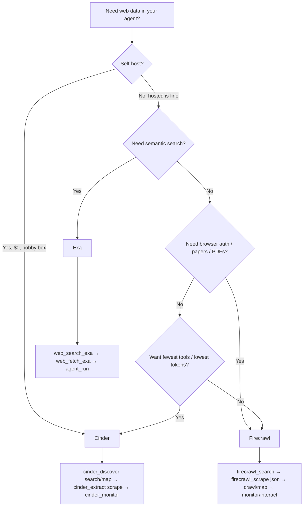

# Exa vs Firecrawl vs Cinder — Which MCP Should You Use?

> **Last updated:** 2026-09-03 · If you just want the answer, read the TL;DR and the decision guide. Everything else is evidence.

---

## TL;DR — Pick in 10 seconds

| If you need…                                                                            | Use           | Why it wins                                                                           |
| --------------------------------------------------------------------------------------- | ------------- | ------------------------------------------------------------------------------------- |
| **Cheapest self-hosted RAG** that handles JS sites, screenshots, and images on a $5 box | **Cinder**    | 1.79 GB pull · ~317 MiB RAM · $0 per scrape · smart mode · no per-token bill          |
| **Semantic search with zero ops**                                                       | **Exa**       | Hosted vector search, highlights & summaries, `agent_run` for multi-step research     |
| **Broadest hosted surface** — browser sessions, papers, PDFs, branding                  | **Firecrawl** | 26 tools including `interact`, `parse`, `research_*`, `monitor_*`, `developer_search` |

**The honest summary:** Cinder already beats both on content fidelity — JS rendering, screenshots, image blobs, deterministic extraction, PII redaction, page actions, BFS crawling, and change monitors. The gap is search intelligence (Exa's semantic index) and breadth (Firecrawl's paper/browser/file tools).

---

## 1. At a Glance

|                                | **Exa**                    | **Firecrawl**                                     | **Cinder**                                                                   |
| ------------------------------ | -------------------------- | ------------------------------------------------- | ---------------------------------------------------------------------------- |
| **Tools**                      | 4 (2 default + 2 optional) | 26                                                | **3** (`cinder_extract` · `cinder_discover` · `cinder_monitor`)              |
| **Design**                     | 1 tool per operation       | 1 tool per operation                              | **1 tool per resource** with `action` enum — fewer tools, fewer LLM misfires |
| **Self-host**                  | ❌ Paid API only           | ✅ But heavy — 6 services, 7.26 GB, ~4.1 GiB RAM  | ✅ **Light** — 4 services, 1.79 GB, ~317 MiB RAM                             |
| **Pricing**                    | Free 1k req/mo → paid      | Free tier (scrape/search/parse) → paid per credit | **$0** self-hosted                                                           |
| **Search speed (self-hosted)** | —                          | 1.9 req/s · p50 5.4s                              | **560 req/s · p50 11ms** (~300×)                                             |

---

## 2. What Each MCP Gives You

### Exa — Semantic search, hosted

- `web_search_exa` — vector search over Exa's own index; understands intent, not just keywords.
- `web_fetch_exa` — fetch one or more URLs as clean markdown.
- `web_search_advanced_exa` _(opt-in)_ — domain filters, date ranges, highlights, summaries, subpage crawling.
- `agent_run` _(opt-in, auth required)_ — multi-step research agent with structured output and Exa Connect sources.

**Best for:** Hosted semantic search and research without running anything yourself.

### Firecrawl — Broadest hosted surface

- `firecrawl_scrape` / `firecrawl_map` / `firecrawl_search` / `firecrawl_crawl` — core web-data tools.
- `firecrawl_extract` (LLM), `firecrawl_parse` (PDF/DOCX/XLSX), `firecrawl_interact` (browser sessions), `firecrawl_agent` (autonomous research).
- `firecrawl_research_*` (papers & GitHub), `firecrawl_developer_search` (issues/PRs/READMEs), `firecrawl_monitor_*` (7 tools with diff & judgment).

**Best for:** Hosted breadth — papers, PDFs, browser auth flows, branding/product/audio extraction.

### Cinder — Light self-hosted, 3 tools

| Tool                  | What it does                                                                                                                                    |
| --------------------- | ----------------------------------------------------------------------------------------------------------------------------------------------- |
| **`cinder_extract`**  | `scrape` (single page) · `scrape_multi` (2–10 URLs in one call, no Redis) · `links` (hyperlinks only) · `batch` / `batch_status` (async, Redis) |
| **`cinder_discover`** | `search` (SearXNG + Brave fallback) · `map` (sitemap → robots → link fallback) · `crawl` / `crawl_status` (async BFS)                           |
| **`cinder_monitor`**  | `create` / `status` / `delete` — hash markdown, fire a signed webhook when it changes                                                           |

**How to use it:** `cinder_discover` (search/map) to find URLs → `cinder_extract` (scrape) to fetch → `cinder_monitor` to watch for changes.

**Cinder-only strengths:** Smart mode (static first, auto-fallback to browser on SPA shells), AI-ready image blobs (`data:image/...;base64,`), quality-ranked images, enriched links (`{url, text, isInternal}`), TF-IDF rerank, and the lightest self-host stack.

---

## 3. Head-to-Head

| Capability                           | Exa     | Firecrawl                     | Cinder                                                                |
| ------------------------------------ | ------- | ----------------------------- | --------------------------------------------------------------------- |
| **Search**                           |
| Semantic (vector) search             | ✅      | ❌                            | ❌                                                                    |
| Keyword search                       | ✅      | ✅                            | ✅ (SearXNG aggregates Google/Bing/DDG/Brave/Mojeek/Wikipedia)        |
| Highlights & summaries               | ✅      | ✅                            | ✅                                                                    |
| Category & date filters              | ✅      | ✅                            | ✅                                                                    |
| Domain filters                       | ✅      | ✅                            | ✅                                                                    |
| **Fetch & Scrape**                   |
| Clean markdown                       | ✅      | ✅                            | ✅                                                                    |
| Multi-URL in one call                | ✅      | ✅                            | ✅ (`scrape_multi`, max 10, no Redis)                                 |
| JS rendering (SPAs)                  | ❌      | ✅                            | ✅ (smart auto)                                                       |
| Screenshots                          | ❌      | ✅                            | ✅                                                                    |
| Image extraction                     | ❌      | ✅                            | ✅ (richer — srcset/picture/lazy, quality-ranked, blob transport)     |
| Structured extraction                | ❌      | ✅ (LLM)                      | ✅ (deterministic CSS, no LLM)                                        |
| PII redaction                        | ❌      | ✅                            | ✅                                                                    |
| Page actions (click/scroll)          | ❌      | ✅ (+ full `interact`)        | ✅                                                                    |
| Links extraction                     | ❌      | ✅                            | ✅ (enriched)                                                         |
| **Crawl & Map**                      |
| Site URL discovery                   | ❌      | ✅                            | ✅                                                                    |
| Multi-page BFS crawling              | Partial | ✅                            | ✅ (more knobs — politeness, retries, globs, webhooks)                |
| **Monitor**                          |
| Change-tracking                      | ❌      | ✅ (7 tools, diff & judgment) | ✅ (lighter — create/status/delete)                                   |
| **Research & Agent**                 |
| Multi-step agent                     | ✅      | ✅                            | ❌ (your AI already orchestrates — chain search → scrape → summarize) |
| Paper & code research                | ❌      | ✅                            | ❌                                                                    |
| Browser automation                   | ❌      | ✅                            | ❌ (page actions only)                                                |
| File parsing (PDF/DOCX)              | ❌      | ✅                            | ❌                                                                    |
| **Ops**                              |
| Self-hosted, $0 per request          | ❌      | ✅ (heavy)                    | ✅ (**light**)                                                        |
| Fewest tools / lowest token overhead | 4       | 26                            | **3**                                                                 |

---

## 4. Decision Guide



**Rule of thumb:** Self-host on a budget → Cinder. Need semantic search without ops → Exa. Need papers, PDFs, or browser auth flows hosted → Firecrawl. You can also mix them — use Exa for semantic queries and Cinder for everything else.

---

## 5. Try Cinder

```bash
git clone https://github.com/Michael-Obele/cinder.git && cd cinder
docker compose up -d
curl http://localhost:8080/health  # → {"status":"ok"}

# MCP server
git clone https://github.com/Michael-Obele/cinder-tmcp.git && cd cinder-tmcp
bun install && cp .env.example .env  # set CINDER_API_URL
bun dev  # → http://localhost:3000/mcp
```

---

## References

- Exa MCP: [exa.ai/docs/reference/exa-mcp](https://exa.ai/docs/reference/exa-mcp) · [github.com/exa-labs/exa-mcp-server](https://github.com/exa-labs/exa-mcp-server)
- Firecrawl MCP: [docs.firecrawl.dev/mcp-server](https://docs.firecrawl.dev/mcp-server) · [github.com/mendableai/firecrawl-mcp-server](https://github.com/mendableai/firecrawl-mcp-server)
- Cinder: [github.com/Michael-Obele/cinder](https://github.com/Michael-Obele/cinder) · Cinder MCP: [github.com/Michael-Obele/cinder-tmcp](https://github.com/Michael-Obele/cinder-tmcp)

> **One-liner:** Cinder gives you Firecrawl-grade scraping and SearXNG search at 560 req/s in 3 tools and 317 MiB — the self-hosted Firecrawl you can actually run on a hobby box.
