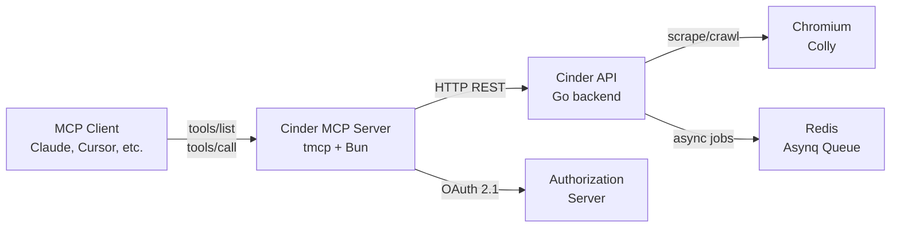

# Cinder MCP 🔥

A [TMCP](https://tmcp.io/) (lightweight MCP) server that exposes the [Cinder](https://github.com/Michael-Obele/cinder) web scraping API to AI assistants through the [Model Context Protocol](https://modelcontextprotocol.io/).

Cinder is a high-performance, self-hosted web scraping API built with Go. This MCP server wraps Cinder's endpoints as type-safe tools that AI assistants can use for web scraping, crawling, and search.

## Features

- **`cinder_scrape`** — Scrape a single webpage and get clean, LLM-ready markdown
  - Smart/static/dynamic modes (auto-detect, Colly, or Chromedp)
  - Optional screenshot capture and image extraction
- **`cinder_crawl`** — Asynchronously crawl entire websites with BFS link-following
  - Configurable depth (1-10) and page limit (1-100)
  - Returns a task ID — poll with `cinder_crawl_status`
- **`cinder_crawl_status`** — Check the status of an async crawl job
  - States: pending → active → completed/failed
  - Returns results as JSON when completed
- **`cinder_search`** — Search the web via Brave Search API (proxied through Cinder)
  - Pagination, domain filtering, result limiting

## Architecture



## Technology Stack

| Component       | Choice                          | Rationale                                   |
| --------------- | ------------------------------- | ------------------------------------------- |
| **MCP SDK**     | [tmcp](https://tmcp.io/)        | Modern, type-safe, composable, Web-standard |
| **Runtime**     | [Bun](https://bun.sh/)          | Fast, native TypeScript, ESM-native         |
| **Validation**  | [Valibot](https://valibot.dev/) | Lightweight, tree-shakable, Standard Schema |
| **Adapter**     | @tmcp/adapter-valibot           | JSON Schema generation from Valibot schemas |
| **Transports**  | HTTP + STDIO + SSE              | MCP spec compliant, local & remote          |
| **Auth**        | @tmcp/auth (SimpleProvider)     | OAuth 2.1 support with MCP compliance       |
| **HTTP Server** | srvx                            | Lightweight Web-standard HTTP server        |

## Quick Start

### Prerequisites

- [Bun](https://bun.sh/) >= 1.2
- A running [Cinder](https://github.com/Michael-Obele/cinder) instance

### Install

```bash
# Clone
git clone https://github.com/Michael-Obele/cinder-tmcp.git
cd cinder-tmcp

# Install dependencies
bun install

# Copy and configure environment
cp .env.example .env
# Edit .env to match your Cinder instance
```

### Run

```bash
# Start in production mode
bun start

# Start with file watching (development)
bun dev
```

The server starts on port 3000 by default and supports:

- **HTTP (MCP Streamable HTTP):** `http://localhost:3000/mcp`
- **SSE (legacy):** `http://localhost:3000/sse`
- **STDIO:** For local CLI tools
- **Health:** `http://localhost:3000/health`

### Test with MCP Inspector

```bash
npx @modelcontextprotocol/inspector http://localhost:3000/mcp
```

## Configuration

All configuration is via environment variables (see `.env.example`):

| Variable         | Default | Description                       |
| ---------------- | ------- | --------------------------------- |
| `CINDER_API_URL` | —       | Your Cinder API instance          |
| `CINDER_API_KEY` | —       | Optional API key                  |
| `PORT`           | `3000`  | HTTP server port                  |
| `OAUTH_ENABLED`  | `false` | Enable OAuth 2.1 auth             |
| `LOG_LEVEL`      | `info`  | Log level (debug/info/warn/error) |

## OAuth 2.1

OAuth 2.1 is **required for production HTTP deployments** per the MCP specification. For local development, you can disable it (`OAUTH_ENABLED=false`).

When enabled, the server uses `@tmcp/auth`'s `SimpleProvider` with in-memory storage. For production, swap to a database-backed store (Redis, Postgres).

## Project Structure

```
cinder-tmcp/
├── src/
│   ├── index.ts              # Entry point (HTTP + STDIO servers)
│   ├── server.ts             # McpServer config & tool registration
│   ├── config.ts             # Environment configuration
│   ├── client.ts             # Cinder HTTP API client
│   ├── auth-provider.ts      # OAuth 2.1 provider setup
│   └── tools/
│       ├── scrape.ts         # cinder_scrape tool
│       ├── crawl.ts          # cinder_crawl tool
│       ├── crawl-status.ts   # cinder_crawl_status tool
│       └── search.ts         # cinder_search tool
├── cinder-mcp/               # Design docs & implementation notes
├── .env.example
├── tsconfig.json
└── package.json
```

## Development

```bash
# TypeScript type check
bun run typecheck

# Start with hot-reload
bun run dev
```

## Learn More

- [Cinder GitHub](https://github.com/Michael-Obele/cinder) — The web scraping API backend
- [TMCP Documentation](https://tmcp.io/) — The MCP SDK used
- [Model Context Protocol](https://modelcontextprotocol.io/) — MCP specification
- [Valibot](https://valibot.dev/) — Schema validation library
