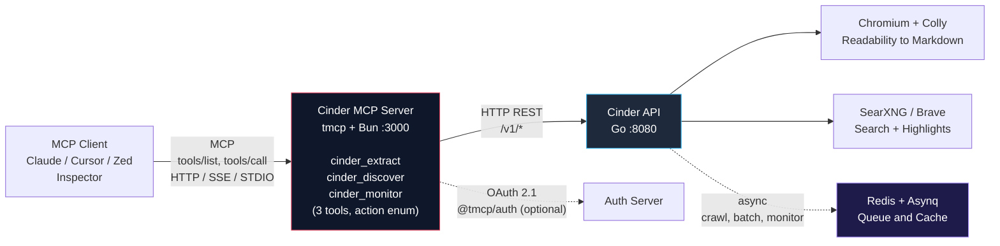

# Cinder MCP 🔥

**Self-hosted Firecrawl alternative for AI agents — 4× lighter, 13× less RAM, with just 3 tools.**

A [TMCP](https://tmcp.io/) server that exposes [Cinder](https://github.com/Michael-Obele/cinder) (Go, self-hosted scraping API) to Claude, Cursor, Zed, and any [MCP](https://modelcontextprotocol.io/) client. One binary, hobby-tier RAM, no per-token bill — full Firecrawl parity with a fraction of the footprint.

> **Outcome:** Turn any site into LLM-ready markdown from your chat. No REST glue, no per-request browser spawn, no cloud bill.

## Why this exists

| What hurts with hosted APIs                                            | What Cinder MCP gives you                                                | Outcome                                |
| ---------------------------------------------------------------------- | ------------------------------------------------------------------------ | -------------------------------------- |
| **$0.01–0.10 per scrape** + rate limits                                | **$0 self-hosted** — one Go binary + 3 containers                        | Ship RAG without a cloud bill          |
| **Heavy Docker stacks** (Firecrawl: ~7.3 GB, 6 services, ~4.1 GiB RAM) | **Light stack: ~1.8 GB, 4 services, ~317 MiB RAM** — measured 2026-08-31 | Runs on a $5/mo hobby box              |
| **8+ tools to choose from** → LLM misfires, token bloat                | **3 resource tools** with `action` enum (≤7 philosophy)                  | Faster, more accurate tool selection   |
| **JS SPAs return empty HTML**                                          | **Smart mode** — static first, fallback to Chromedp                      | Works on React/Vue without guessing    |
| **Noisy HTML**                                                         | **Readability main-content** + ad block                                  | Clean markdown your LLM actually wants |

**Proof, not promises:**

- **Docker size (measured 2026-08-31):** Cinder stack **1.79 GB** vs Firecrawl **7.26 GB** — **4× lighter** (see table below)
- **Running RAM:** Cinder **~317 MiB** vs Firecrawl **~4.1 GiB** — **13× less**
- **Search benchmark** ([Cinder `SEARCH_COMPARISON.md`](https://github.com/Michael-Obele/cinder/blob/main/docs/SEARCH_COMPARISON.md), 10 workers/30s): **Cinder 560 req/s p50 11ms** vs Firecrawl self-hosted **1.9 req/s p50 5.4s** — **~300× throughput** at same $0 cost

## 3 tools, not 8 — resource-oriented multiplexing

One tool per domain resource with `action` enum (see `arch.md` "Why 7 Tools Instead of 17" — collapsed 17→7). Fewer tools → less token overhead, higher LLM accuracy, stays under MCP client limits.

| Tool                  | `action`       | What it does                                                                                                         | Endpoint                            |
| --------------------- | -------------- | -------------------------------------------------------------------------------------------------------------------- | ----------------------------------- |
| **`cinder_extract`**  | `scrape`       | Single page → clean markdown (smart/static/dynamic, screenshots, images, summary, `extract_schema`, `include_links`) | `POST /v1/scrape`                   |
|                       | `links`        | Hyperlinks only — enriched `{url, text, isInternal}`, no markdown                                                    | `POST /v1/scrape` + `include_links` |
|                       | `batch`        | Enqueue up to 20 URLs async (Redis) → `batch_id`                                                                     | `POST /v1/batch/scrape`             |
|                       | `batch_status` | Poll batch `total/completed/failed`                                                                                  | `GET /v1/batch/:id`                 |
| **`cinder_discover`** | `search`       | Web search via SearXNG (Brave fallback), domain filters, `requiredText`/`maxAge`/`fast`/`rerank`                     | `POST /v1/search`                   |
|                       | `map`          | Discover URLs via sitemap/robots.txt/link fallback, `search` filter, `limit` 1–5000                                  | `POST /v1/map`                      |
|                       | `crawl`        | Enqueue BFS crawl async (Redis) → task ID                                                                            | `POST /v1/crawl`                    |
|                       | `crawl_status` | Poll crawl `pending→active→completed/failed`                                                                         | `GET /v1/crawl/:id`                 |
| **`cinder_monitor`**  | `create`       | Hash markdown, fire signed webhook on change                                                                         | `POST /v1/monitor`                  |
|                       | `status`       | Get config, last hash, next check                                                                                    | `GET /v1/monitor/:id`               |
|                       | `delete`       | Stop & remove monitor                                                                                                | `DELETE /v1/monitor/:id`            |

**How to use:** `cinder_discover` (search/map) to find URLs → `cinder_extract` (scrape) to fetch → `cinder_monitor` to watch for changes. Async actions (`crawl`, `batch`, `monitor`) require Redis — poll their `*_status` until done.

## Docker size — the difference you feel

Measured on the same host, 2026-08-31 (`docker images` + `docker stats --no-stream`):

| Stack         | Images (pull size)                                                                                                                                           | Total pull   | Running RAM (all containers)                                                                                                          | Containers |
| ------------- | ------------------------------------------------------------------------------------------------------------------------------------------------------------ | ------------ | ------------------------------------------------------------------------------------------------------------------------------------- | ---------- |
| **Cinder**    | `cinder-api` 1.08 GB + `searxng` 375 MB + `redis:7-alpine` 60.7 MB + `cinder-mcp` 274 MB                                                                     | **~1.79 GB** | **~317 MiB** (`api` 179 MiB + `searxng` 115 MiB + `redis` 11 MiB + `mcp` 14 MiB)                                                      | **4**      |
| **Firecrawl** | `firecrawl` 2.49 GB + `playwright-service` 2.03 GB + `nuq-postgres` 642 MB + `redis:alpine` 160 MB + `rabbitmq:3-management` 389 MB + `foundationdb` 1.55 GB | **~7.26 GB** | **~4.1 GiB** (`api` 3.09 GiB + `playwright` 391 MiB + `rabbitmq` 452 MiB + `postgres` 85 MiB + `foundationdb` 76 MiB + `redis` 8 MiB) | **6**      |

**Outcome:** Cinder pulls **4× less**, runs in **13× less RAM**, needs **2 fewer services**. On a 512 MB Fly.io `shared-cpu-1x` or $5 Hetzner, Cinder fits — Firecrawl doesn't.

> Reproduce: `docker images --format "{{.Repository}}:{{.Tag}} {{.Size}}"` and `docker stats --no-stream` while both stacks are up. Numbers are host-measured, not marketing.

## Architecture


```mermaid
flowchart LR
    Client["MCP Client<br>Claude / Cursor / Zed<br>Inspector"] -->|"MCP<br>tools/list, tools/call<br>HTTP / SSE / STDIO"| MCP["Cinder MCP Server<br>tmcp + Bun :3000<br><br>cinder_extract<br>cinder_discover<br>cinder_monitor<br>(3 tools, action enum)"]
    MCP -->|"HTTP REST<br>/v1/*"| API["Cinder API<br>Go :8080"]
    API --> Scraper["Chromium + Colly<br>Readability to Markdown"]
    API --> Search["SearXNG / Brave<br>Search + Highlights"]
    API -.->|"async<br>crawl, batch, monitor"| Queue["Redis + Asynq<br>Queue and Cache"]
    MCP -.->|"OAuth 2.1<br>@tmcp/auth (optional)"| Auth["Auth Server"]
    style MCP fill:#0f172a,stroke:#e94560,color:#fff
    style API fill:#1e293b,stroke:#38bdf8,color:#fff
    style Queue fill:#1e1b4b,stroke:#a78bfa,color:#fff
```

## Technology Stack

| Component       | Choice                          | Rationale                                   |
| --------------- | ------------------------------- | ------------------------------------------- |
| **MCP SDK**     | [tmcp](https://tmcp.io/)        | Modern, type-safe, composable, Web-standard |
| **Runtime**     | [Bun](https://bun.sh/)          | Fast, native TypeScript, ESM-native         |
| **Validation**  | [Valibot](https://valibot.dev/) | Lightweight, tree-shakable, Standard Schema |
| **Adapter**     | @tmcp/adapter-valibot           | JSON Schema generation from Valibot schemas |
| **Transports**  | HTTP + STDIO + SSE              | MCP spec compliant, local & remote          |
| **Auth**        | @tmcp/auth (SimpleProvider)     | OAuth 2.1 support with MCP compliance       |
| **HTTP Server** | srvx                            | Lightweight Web-standard HTTP server        |

## Quick Start

### Prerequisites

- [Bun](https://bun.sh/) >= 1.2
- A running [Cinder](https://github.com/Michael-Obele/cinder) instance

### Install

```bash
# Clone
git clone https://github.com/Michael-Obele/cinder-tmcp.git
cd cinder-tmcp

# Install dependencies
bun install

# Copy and configure environment
cp .env.example .env
# Edit .env to match your Cinder instance
```

### Run

```bash
# Start in production mode
bun start

# Start with file watching (development)
bun dev
```

The server starts on port 3000 by default and supports:

- **HTTP (MCP Streamable HTTP):** `http://localhost:3000/mcp`
- **SSE (legacy):** `http://localhost:3000/sse`
- **STDIO:** For local CLI tools
- **Health:** `http://localhost:3000/health`

### Test with MCP Inspector

```bash
npx @modelcontextprotocol/inspector http://localhost:3000/mcp
```

## Configuration

All configuration is via environment variables (see `.env.example`):

| Variable         | Default | Description                       |
| ---------------- | ------- | --------------------------------- |
| `CINDER_API_URL` | —       | Your Cinder API instance          |
| `CINDER_API_KEY` | —       | Optional API key                  |
| `PORT`           | `3000`  | HTTP server port                  |
| `OAUTH_ENABLED`  | `false` | Enable OAuth 2.1 auth             |
| `LOG_LEVEL`      | `info`  | Log level (debug/info/warn/error) |

## OAuth 2.1

OAuth 2.1 is **required for production HTTP deployments** per the MCP specification. For local development, you can disable it (`OAUTH_ENABLED=false`).

When enabled, the server uses `@tmcp/auth`'s `SimpleProvider` with in-memory storage. For production, swap to a database-backed store (Redis, Postgres).

## Project Structure

```
cinder-tmcp/
├── src/
│   ├── index.ts              # Entry point (HTTP + STDIO servers)
│   ├── server.ts             # McpServer config & 3 resource tools
│   ├── config.ts             # Environment configuration
│   ├── client.ts             # Cinder HTTP API client
│   ├── auth-provider.ts      # OAuth 2.1 provider setup
│   └── tools/
│       ├── extract.ts        # cinder_extract (scrape|links|batch|batch_status)
│       ├── discover.ts       # cinder_discover (search|map|crawl|crawl_status)
│       └── monitor.ts        # cinder_monitor (create|status|delete)
├── cinder-mcp/               # Design docs & implementation notes
├── .env.example
├── tsconfig.json
└── package.json
```

> **Design:** 3 resource-oriented tools (≤7 philosophy) — 1 tool per domain resource with `action` enum, not 1 tool per operation. See `src/server.ts` instructions and `src/tools/extract.ts` / `discover.ts` for the `v.variant("action", [...])` pattern.

## Development

```bash
# TypeScript type check
bun run typecheck

# Start with hot-reload
bun run dev
```

## Learn More

- [Cinder GitHub](https://github.com/Michael-Obele/cinder) — The web scraping API backend
- [TMCP Documentation](https://tmcp.io/) — The MCP SDK used
- [Model Context Protocol](https://modelcontextprotocol.io/) — MCP specification
- [Valibot](https://valibot.dev/) — Schema validation library
